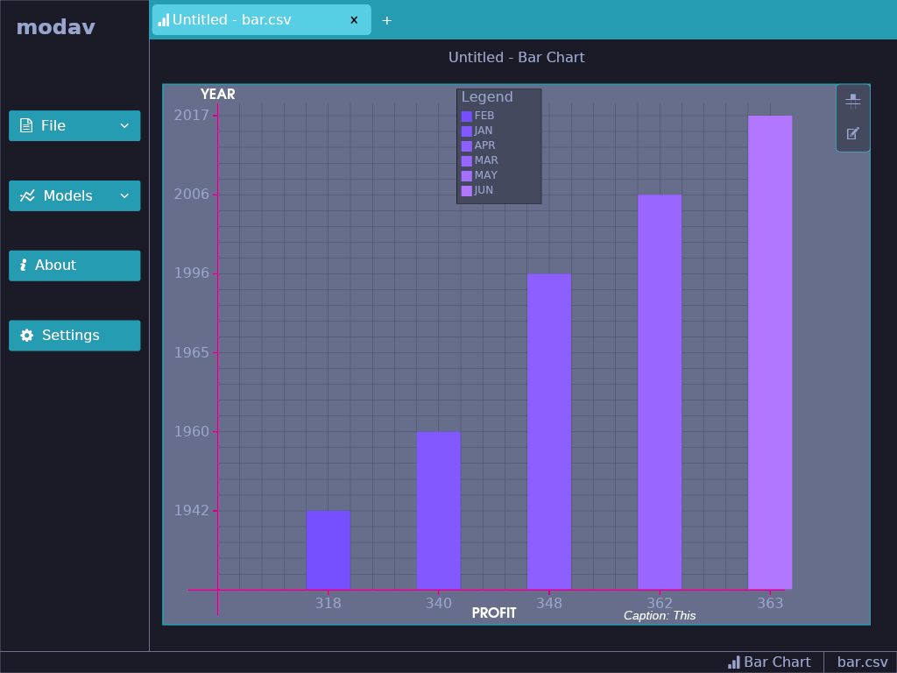

# Core

# Modern Data Visualisation Tool (Modav)

## Description

This is a personal learning project aimed at creating a simple, intuitive, and modern data visualization tool using Rust. 

The tool is designed to enable users to effortlessly explore and present their data in various visual forms.

The project is split into 2 parts. The core functionality and the GUI application. This repository is for GUI Application. The GUI repo can be found [here](https://github.com/EmmanuelDodoo/modav_core).

## Planned Features/Goals

I plan to support the most common dataset operations, models and data formats. I’ve thus grouped the planned features accordingly.

### Supported File Formats

- CSV  and CSV-like data (like TSV)
- JSON
- Excel/Spreadsheet Files

### Visualisation Models (Not from this application)

- Line Charts

- Tables

- Bar graphs

- Tree graphs

## Contributing

At this moment, this project is specifically for gaining experience in Rust so contributions are closed. However, should the project expand past the set goals above, Contributions will be allowed.

## License

This project is licensed under the [MIT License](https://opensource.org/license/mit/).

## Acknowledgement

- [Iced](https://github.com/iced-rs/iced)
- [Iced-aw](https://github.com/iced-rs/iced_aw)
